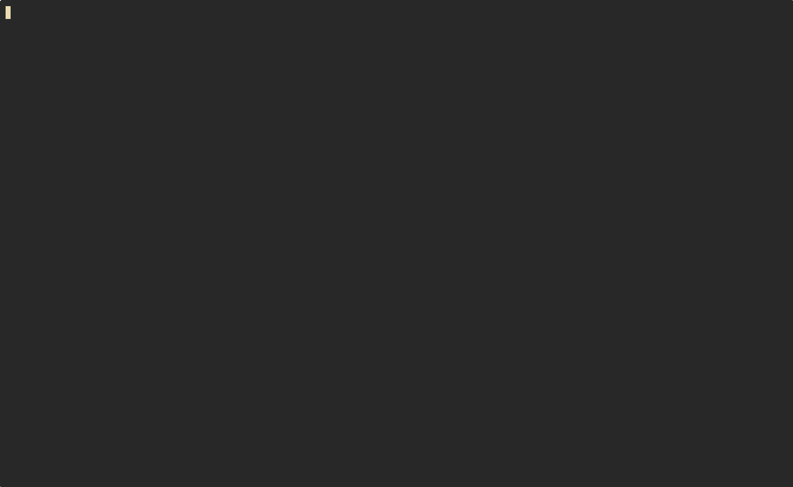

* minilisp

A tiny, "aggressively LL(1) parseable" LISP.

Minilisp aims to provide just enough on top of the lambda calculus to be an usable programming language, and absolutely nothing more. It is essentially a read-only language; all the built in operators deliberately written with obscure unicode characters to make it difficult to write by hand but easy to parse.

This implementation provides an interpreter via ~run~ command, a REPL via ~repl~, and a compiler to NASM x86 assembly via ~compile~.

** Demo
Minilisp is capable of generating random, valid programs. This is useful for demonstration purposes and testing other implementations. This is still a work in progress, and does not always generate valid or interesting programs.

** Using the compiler
The compiled assembly doesn't depend on any dynamic libraries (libc etc.) so binaries should run on any version and distribution of linux - although they will only work on linux.

To compile you will need the ~nasm~ assembler and ~ld~ or another linker.
+ ~cargo run compile <path to minilisp code> > myprog.asm~
+ ~nasm -f elf64 myprog.asm -o myprog.o~
+ ~ld myprog.o -o myprog~

** Examples
Simple add-one function.
#+begin_src
(≜ add-one (λ x (+ x 1)) (add-one 5))
#+end_src

#+begin_src
6
#+end_src

The Y combinator, necessary for recursion as lambdas cannot reference themselves in their own body.
#+begin_src
(λ f ((λ x (f (x x))) (λ x (f (x x)))))
#+end_src

Factorial function using the Y combinator.
#+begin_src
(≜ Y
    (λ f ((λ x (f (x x))) (λ x (f (x x)))))
    (≜ factorial
        (Y (λ f
            (λ n
                (? (= n 0)
                    1
                    (× n (f (− n 1)))))))
        (factorial 5)))
#+end_src

#+begin_src
120
#+end_src

Fibonacci numbers using same.
#+begin_src
(≜ Y
    (λ f ((λ x (f (x x))) (λ x (f (x x)))))
    (≜ fib
        (Y (λ f
            (λ n (? (= n 0)
                0
                (? (= n 1)
                    1
                    (+ (f (− n 1)) (f (− n 2))))))))
        (fib 10)))
#+end_src

#+begin_src
55
#+end_src

List length.
#+begin_src
(≜ Y
    (λ f ((λ x (f (x x))) (λ x (f (x x)))))
    (≜ length
        (Y (λ f (λ lst (? (∘ lst) 0 (+ 1 (f (→ lst)))))))
        (length (∷ 1 (∷ 2 (∷ 3 ∅))))))
#+end_src

#+begin_src
3
#+end_src

** Specification
*** Tokens
|--------+---------+-------------------------+------------------------|
| Symbol | Unicode | Name                    | Example                |
|--------+---------+-------------------------+------------------------|
| (      | U+0028  | Left paren              |                        |
| )      | U+0029  | Right paren             |                        |
| +      | U+002B  | Addition                | ~(+ 2 3) → 5~          |
| −      | U+2212  | Subtraction             | ~(− 5 2) → 3~          |
| ×      | U+00D7  | Multiplication          | ~(× 3 4) → 12~         |
| =      | U+003D  | Equality                | ~(= 5 5) → 1~          |
| ?      | U+003F  | Conditional             | ~(? 1 10 20) → 10~     |
| λ      | U+03BB  | Lambda                  | ~(λ x (+ x 1))~        |
| ≜      | U+225C  | Let binding             | ~(≜ x 5 (+ x x)) → 10~ |
| ∅      | U+2205  | Nil (empty list)        | ~∅~                    |
| ∷      | U+2237  | Cons (pair constructor) | ~(∷ 1 2)~              |
| ←      | U+2190  | Car (first element)     | ~(← (∷ 1 2)) → 1~      |
| →      | U+2192  | Cdr (second element)    | ~(→ (∷ 1 2)) → 2~      |
| ‹      | U+2039  | Less than               | ~(‹ 1 2) → 1~          |
| ›      | U+203A  | Greater than            | ~(› 1 2) → 0~          |
| ∧      | U+2227  | Logical and             | ~(∧ 1 0) → 0~          |
| ∨      | U+2228  | Logical or              | ~(∨ 1 0) → 1~          |
| ¬      | U+00AC  | Logical not             | ~(¬ 0) → 1~            |
| ∘      | U+2218  | Null check              | ~(∘ ∅) → 1~            |
|--------+---------+-------------------------+------------------------|

*** Grammar
#+begin_src
program    ::= expr
expr       ::= number | identifier | '(' paren-expr ')'
paren-expr ::= '+' expr expr | '−' expr expr | '×' expr expr
                | '=' expr expr       | '?' expr expr expr
                | 'λ' identifier expr | '≜' identifier expr expr
                | '∅' | '∷' expr expr | '←' expr | '→' expr
                | '‹' expr expr | '›' expr expr
                | '∧' expr expr | '∨' expr expr
                | '¬' expr | '∘' expr | expr expr
#+end_src

The final ~paren-expr~ form, ~'(' expr expr ')'~, is the application of a lambda (the first ~expr~) with an argument.
